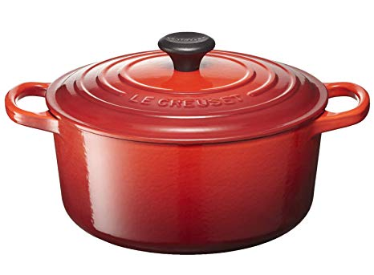

# Dutch oven bread 2.0 - Sourdough 
> Recipe for bread baked in Dutch oven or a cast iron casserole. 

## Step 0 - Make Sourdoug starter [2-5 days of feeding]
1. Mix 2 tbs organic weat flour with 2 tbs luke warm water. Consistency should be something like thick pancacke dough. Leave at a warm place for 24 hours. It should have some bubbles on the surface. It might smell a bit funny. That's ok, cause it will pass.
2. Feed the dogh with another 2 tbs organic weat flour with 1.5 tbs luke warm water. Let rest for 12-24 hours and remove everything but 2 tbs of the dough and keep feeding the same amount. 
3. After 5 days you should have bubbly, sour smelling sourdough starter. Congratz! You can keep it in the refrigerator and feed it every 4-5 day to keep it happy. Let it be outside during its mealtime!  

## Step 1 - Power up the starter (1/2 - 1 day)
1. Mix 2 dl wheat flour and 1.5 dl water with your starter. Let rest for 12-24 hours. 
2. Put back 50-100 gram of dough in the fridge (So you can make more sourdough bred in the future without step 0) and keep the rest for baking. 

## Step 2 - Actually making bread doguh (1-4 hours) 
1. Mix 1/2 package of fresh bread yeast (25gr) with 0.5 dl of 37° tempered water and stir out the yeast.
2. Add 4 dl of 37° water and mix 1 dl flour. Let it rest for an episode of you favorite podcast. 
3. Mix in 400 gr of flour and add the sourdough starter. Keep adding flour until the dough starts to release from the edges of the bowl.  
4. Add 20 grams of salt (without iodine! Iodine kills yeast) along with a splash of water and mix into the dough
5. Add 0.5 dl of olive oil and some more flour until the dough is somewhat firm. 
6. Let it rise for 1-2 hours. 

## Step 3 - Bread forming and rising
1. Cut some baking paper in the approximate size of base of the cast iron casserole. Put it on a plate (This will make sense later)
2. Put your cast iron casserole in the oven on 260° with lid and all. It should be in 40 minutes before you start baking the bread. 
3. _Gently_ tilt the dough out on a flouved baking table (any clean surface will suffice. Ipads not recommended). 
4. Fold the dough like an envelope (which is similar but not exact like [the konami code](https://en.wikipedia.org/wiki/Konami_Code). You should do: _up, down, left, right_). 
5. Let the dough rest for 30 on the baking paper cover plate under a towel, You might wanna add some flour on top in order to prevent the towel from sticking. 

## Step 4 - Scouring and baking
1. Take out the caserole.
2. Take a sharp knife and do a large score over the bread. This will help the bread to rise freely
3. Gently drop the bread in by tilting the plate and cover with the lid and put it in the owen
4. Lower the temperature in the oven to 210° and bake 20 minutes. Remove lid but keep the rest in.
5. Bake for additional 30-minutes. You want the bread to get some serious color. And it should be *hard*
6. Take it out and let rest on a cooling rack (or somethig other that let air pass under it) until cool. 
7. Enjoy!
